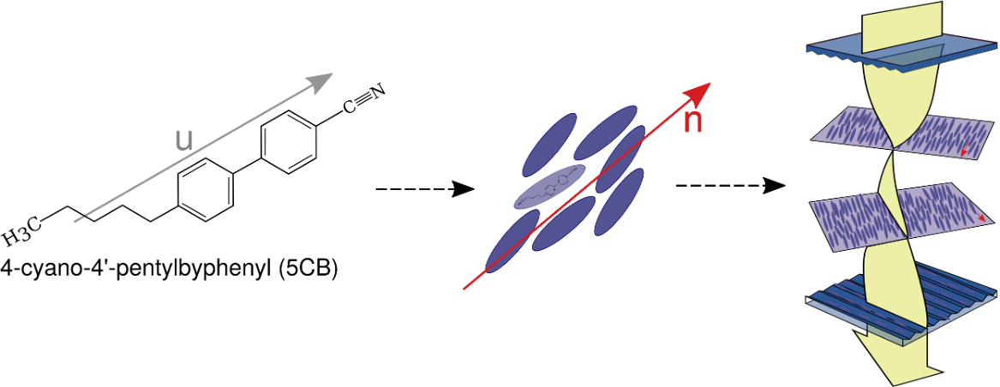

Scientific Background
*********************
Optical microscopy is the most direct way to obtain information on the structure of complex fluids. Molecular length scales for these fluids, even for polymers, lie in the submicron range making difficult to image with a simple optical microscope. However, their inherent birefringence makes it so response to stimuli reveals the supermolecular textures and structures they produce. 

In particular, birefringence arises in materials that have anisotropic optical properties, meaning their refractive index varies depending on the direction of light passing through them. This phenomenon occurs due to the internal structure of the material, such as the alignment of molecules in liquid crystals or the presence of specific crystalline orientations. Birefringence can be observed as distinct colors or patterns, providing valuable information about the material's internal structure, orientation, and stress distribution. Understanding birefringence helps in characterizing materials, diagnosing defects, and developing advanced optical devices.

:term:`LCPOM` allows researchers to visualize and analyze the optical behavior of liquid crystals and other anisotropic materials under controlled, customizable conditions. This capability is crucial for validating theoretical models, optimizing material properties for specific applications, and simulating experimental scenarios that closely mimic real-world laboratory setups, thereby bridging the gap between simulation and practical experimentation.

Basics of Liquid Crystals
===========================
Liquid crystals exhibit long-range orientational order but lack long-range translational order, which allows them to flow relatively easily and respond to various external stimuli such as electric fields, magnetic fields, heat, light, and mechanical forces. The molecular anisotropy of LCs gives rise to several fascinating properties, including birefringence. 

    LCs are good reporters of molecular-scale events given their anisotropy. 

Principles of Polarized Optical Microscopy (:term:`POM`)
===========================================================

Principles of Color science
=============================

How does :term:`LCPOM` utilizes these principles?
=================================================
